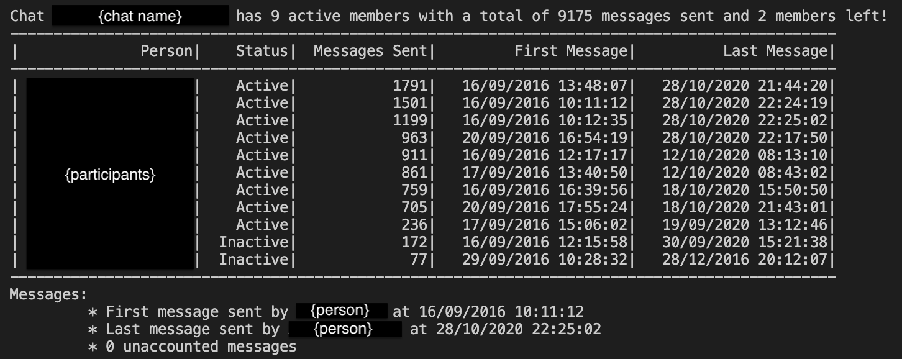

# facebook-messages-analyser
Console App to analyse Facebook messages

## Motivation:
I discovered that Facebook allows you to [download all of the information they hold about you](https://www.facebook.com/help/1701730696756992?helpref=hc_global_nav).
Included in this is all of the messages you have ever sent, which can be downloaded in JSON format.
I was interested in getting some stats on some of my group chats which have been running for years, eg. total number of messages sent in the group and how many by each participant.

## In Use:
Below is a sample analysis of a chat. It tells you the chat name and how many active users it had (at the time of you downloading the data), the total number of messages as well as how many users have left the chat in its liftime. 
It then displays a table of all the participants of the chat with their status (Active or Inactive), the number of messages they have sent and the dates of the first and last messages they sent in the chat.
Additionally it tells you the time and participant of the first and last message sent in the chat, as well as how many 'unaccounted messages' there are (this was more of a check to make sure I hadn't missed any participants).


## How to get data from Facebook:
1. Login to your Facebook account and navigate to: Settings & Privacy > Settings > Your Facebook information > Download your information
2. Request a copy of your data in JSON format, and wait for Facebook to create the download
3. Once downloaded go to the messages folder, inside is 'archived_threads' (archived chats) and 'Inbox' (active chats)
4. Each chat has its own folder, inside is one or many .json files
 
## How to use:
1. Clone this repo and make a folder called 'Data' 
2. Inside this make a folder, with a unique name, for each chat that you wish to analyse
3. Copy and paste in all 'message_{n}.json' files 
4. In terminal run ```dotnet run``` and the app will display all folders/chats to choose from
5. Select a chat to analyse (see example above)
